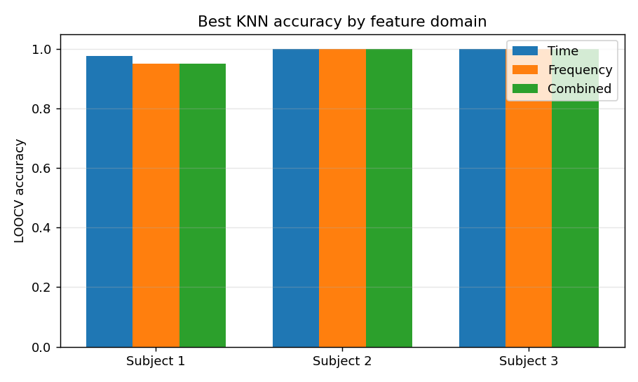
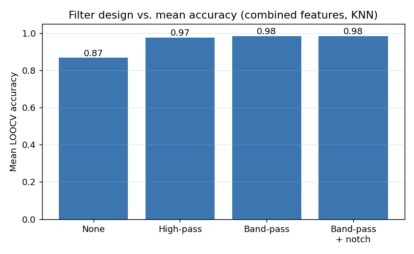
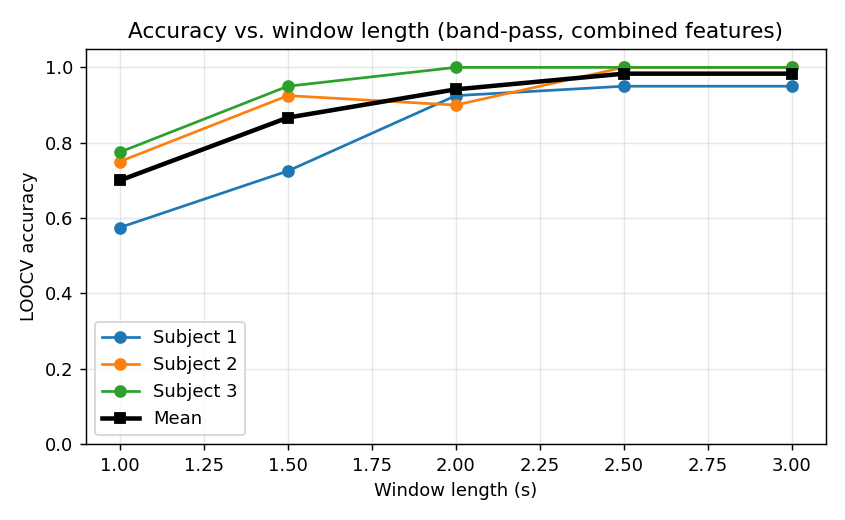

# EMG Signal Classification

**Recognising hand gestures from surface electromyography (sEMG) with a classic
DSP + machine-learning pipeline.**

[](https://www.python.org/)
[](https://scikit-learn.org/)
[](LICENSE)

This project takes raw multi-channel sEMG recordings, conditions them with
digital filters, slices them into windows, extracts time- and frequency-domain
features, and classifies the underlying muscle-activation pattern (rest vs. two
hand gestures). It reaches **95–100 % leave-one-out accuracy** across three
subjects and quantifies *how much* the signal-conditioning front end actually
matters.

```
load .mat  →  band-pass / notch filter  →  windowed segmentation
           →  time + frequency features  →  ML classifier (LOOCV)
```

---

## Results at a glance

**Per-subject accuracy** (3-class: rest / gesture 1 / gesture 2, leave-one-trial-out CV):

| Subject | Time-domain | Frequency-domain | Combined |
|:------:|:-----------:|:----------------:|:--------:|
| 1 | 0.975 | 0.950 | 0.950 |
| 2 | 1.000 | 1.000 | 1.000 |
| 3 | 1.000 | 1.000 | 1.000 |

<p align="center">
  
</p>

### The signal-conditioning front end is what moves the needle

Two ablations show that the DSP front end — not the classifier — drives
performance. Filtering out drift/motion artefacts lifts mean accuracy from
**0.87 → 0.98**, and a window must be long enough (~2.5 s) to capture a stable
muscle contraction.

<p align="center">
  
  
</p>

| Front end | Mean acc. | | Window | Mean acc. |
|:--|:--:|---|:--:|:--:|
| No filter | 0.867 | | 1.0 s | 0.700 |
| High-pass (10 Hz) | 0.975 | | 1.5 s | 0.867 |
| Band-pass (10–45 Hz) | 0.983 | | 2.0 s | 0.942 |
| Band-pass + notch | 0.983 | | 2.5–3.0 s | 0.983 |

By contrast, the choice of classifier barely matters once features are good:
KNN, SVM and Random Forest all reach **0.983**, LDA **0.967**
([`experiment_classifiers.png`](results/figures/experiment_classifiers.png)).

> All numbers above are reproduced by `scripts/run_classification.py` and
> `scripts/run_experiments.py`; the CSVs and figures live in [`results/`](results/).

---

## How it works

### 1. Signal conditioning — [`emg/preprocessing.py`](emg/preprocessing.py)
Zero-phase Butterworth filters (`filtfilt`, no group delay):
- **Band-pass 10–45 Hz** (default) keeps the EMG band while rejecting baseline
  drift and motion artefacts.
- **High-pass** and an **IIR notch** are also provided. *Note:* the dataset is
  sampled at 100 Hz, so its Nyquist is 50 Hz — a 50 Hz mains notch sits at
  Nyquist and is a no-op here; the band-pass already removes it. The notch is
  kept for higher-rate recordings.

### 2. Windowed segmentation — [`emg/segmentation.py`](emg/segmentation.py)
The stimulus channel is piece-wise constant; each contiguous run is one
repetition. A fixed-length window (default 3.0 s) is cut from the start of every
repetition so all trials share the same dimensionality.

### 3. Feature extraction — [`emg/features.py`](emg/features.py)
Computed per channel and concatenated:

| Domain | Features |
|---|---|
| **Time** | Mean Absolute Value (MAV), Root Mean Square (RMS), Waveform Length (WL), Zero Crossings (ZC), Slope Sign Changes (SSC) |
| **Frequency** | Mean Frequency (MNF), Median Frequency (MDF), Total Spectral Power, Peak Frequency |

### 4. Classification — [`emg/classification.py`](emg/classification.py)
KNN (with a K sweep), SVM, Random Forest and LDA, each wrapped in a
`StandardScaler → estimator` pipeline. Standardisation is fitted **inside** each
CV fold to prevent test-set leakage. Evaluation is **leave-one-trial-out
cross-validation**, the natural low-variance estimator for this small dataset.

---

## Quickstart

```bash
git clone https://github.com/omarsaqr12/EMG-Signal-Classification.git
cd EMG-Signal-Classification

python -m venv venv
source venv/bin/activate        # Windows: venv\Scripts\activate
pip install -r requirements.txt

python scripts/run_classification.py   # headline results + confusion matrices
python scripts/run_experiments.py      # filter / window / classifier ablations
```

Using the library directly:

```python
from emg import load_subject, apply_filter, segment_trials, extract_feature_matrix
from emg.classification import best_k

sub      = load_subject(1)
filtered = apply_filter(sub.emg, kind="bandpass", fs=sub.fs)
trials   = segment_trials(filtered, sub.stimulus, window_samples=300)
X, y     = extract_feature_matrix(trials, fs=sub.fs, domain="combined")

k, acc, _ = best_k(X, y)
print(f"Best K={k}, leave-one-out accuracy={acc:.3f}")
```

---

## Dataset

Three subjects (`data/subject_{1,2,3}.mat`), each a continuous recording:

| Field | Shape | Meaning |
|---|---|---|
| `emg` | `(16782, 10)` | 10-channel sEMG amplitudes |
| `stimulus` | `(16782,)` | label per sample — `0` rest, `1`/`2` gestures |
| `subject` | scalar | subject id |

Sampling rate **100 Hz**; 40 repetitions per subject (20 rest, 10 + 10 gestures).

---

## Project structure

```
EMG-Signal-Classification/
├── emg/                       # reusable library
│   ├── io.py                  #   load .mat recordings
│   ├── preprocessing.py       #   band-pass / high-pass / notch
│   ├── segmentation.py        #   windowed trial segmentation
│   ├── features.py            #   time- & frequency-domain features
│   └── classification.py      #   classifiers + leave-one-out CV
├── scripts/
│   ├── run_classification.py  # headline accuracy + confusion matrices
│   └── run_experiments.py     # filter / window / classifier ablations
├── data/                      # subject_1.mat … subject_3.mat
├── results/                   # generated CSVs + figures
├── docs/                      # project report & background PDFs
├── legacy/                    # original course submission scripts
├── requirements.txt
└── README.md
```

---

## Academic context

Developed for **CSCE 3611 – Digital Signal Processing** at The American
University in Cairo (supervised by Dr. Seif Eldawlatly). The
[`legacy/`](legacy/) folder preserves the original course scripts; the `emg/`
package is a cleaned-up, modular reimplementation with added feature extraction,
multiple classifiers and reproducible ablation studies.

**Authors:** Omar Saqr · Adham Ali · Saif Abdelfattah

## License

Released under the [MIT License](LICENSE).
